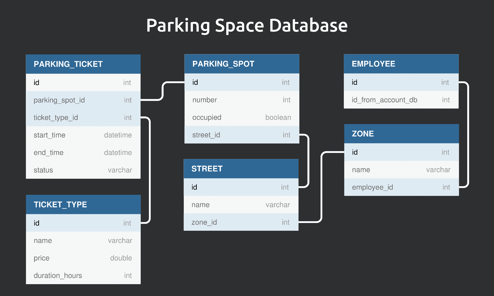

<h1 align="center">Automated Parking System</h1>

## Services diagram

 
    

## Services description

1. [Parking Space Service](./01_parking_space_service/) [Java]
2. Account Service [Java]
3. Notifications Service [Java]
4. [Web Application](./04_web_application/) [JavaScript / React]
5. Parking Meter [Python]
6. Parking Sensors [Python]
7. Parking Space Database [MySQL]

## Parking Space Database diagram

 
    

