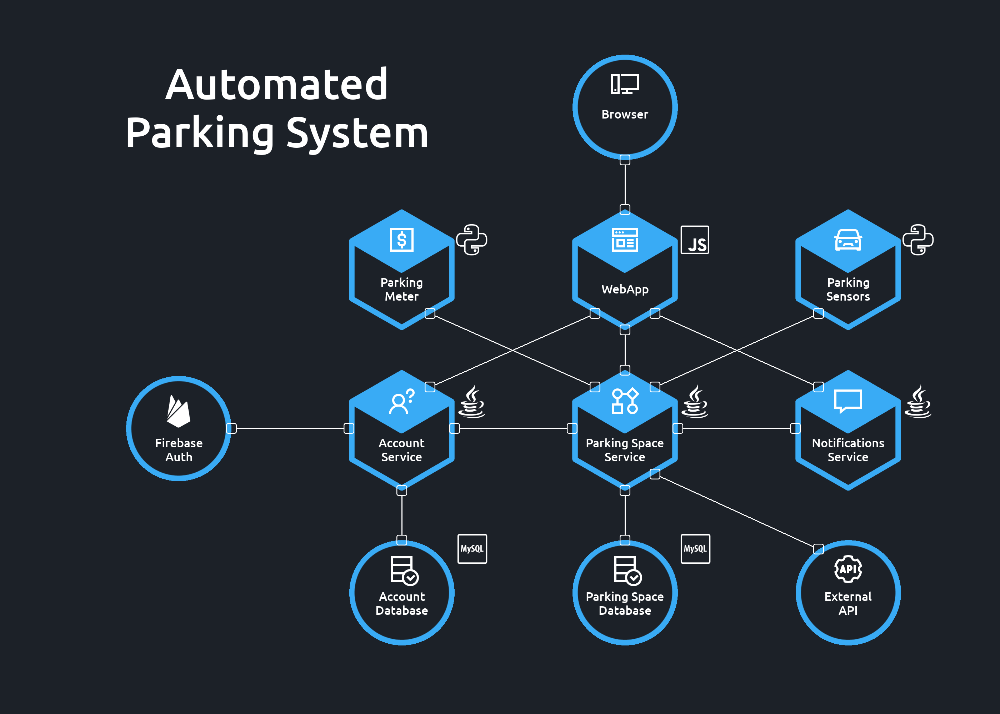

<h1 align="center">Automated Parking System</h1>

## Services diagram

<p align="center"> 
    
</p>

## Services description

1. [Parking Space Service](./00_main_parking_project/01_parking_space_service/) [Java] - The core of the whole application. External devices connect to this microservice, providing it with information about the fact that the parking space has been occupied or released and about the fees paid via parking meters. The module records this information in a database and plans tasks that will verify whether the payment was made on time and whether the car left the parking lot on schedule. If there is any discrepancy, a message is sent to the notification service using JMS. The service also issues an external REST API, which can be queried in order to obtain any information about the current status of the car park as well as past events.

2. [Account Service](./00_main_parking_project/02_account_service/) [Java] - It is a kind of proxy service that allows you to use authentication and authorization services provided by third party providers. Both the web application and other micro-services contact this module in order to verify whether a given user has the right to obtain the requested resources.

3. [Notifications Service](./00_main_parking_project/03_notifications_service/) [Java] - A service that allows you to get quick information about all undesirable situations that currently occur in the system. It receives information via the JMS topic, aggregates it and makes sure it is up to date. A web client can query this microservice using the REST API.

4. [Web Application](./04_web_application/) [JavaScript / React] - Web client that allows easy access to all the information inside the system - such as the current status of occupied parking spaces, notifications about undesirable events and the history of purchased parking tickets. Access to the application is protected by a combination of login and password. Based on the data entered, the user's access level is verified. The system administrator can also edit information about other users.

5. Parking Meter [Python]

6. [Parking Sensors](./06_parking_sensor) [Python] - Mock client, whose task is to pass information about the fact that a given parking space has been taken or released to the main micro-service. Communication with the application takes place via SOAP.

7. [Parking Space Database](./07_parking_space_database) [MySQL] - Database storing all information on parking zones, current status of occupied parking spaces, and purchased tickets.

## Hit the ground running

<details><summary><i>Set up project</i></summary><p>

```bash
# clone repository
git clone https://github.com/SkalskiP/WebServicesShowOff.git

# navigate to main directory
cd WebServicesShowOff
```
</p></details>

<details><summary><i>Set up and run Web Application</i></summary><p>

```bash
# navigate to web application directory
cd 04_web_application

# install dependencies
npm install

# serve with hot reload at localhost:3000
npm start
```
</p></details>

<details><summary><i>Set up and run Parking Sensor Client</i></summary><p>

```bash
# navigate to parking sensor directory
cd 06_parking_sensor

# run set up shell script
sudo sh setup_python_with_env.sh

# activate virtual environment
source .env/bin/activate

# run client
python3 parking_sensor_terminal.py
```
</p></details>

<details><summary><i>Set up Database for Parking Service</i></summary><p>

1. Install MySQL on your system
2. Create Database and run provided SQL script
3. Set up MySQL on Application Server
4. Add datasource to your application server with JNDI name java:/PARKING_SPACE
5. Profit

</p></details>

## Parking Sensor SOAP Client

<p align="center"> 
    
</p>

## Parking Space Database diagram

<p align="center"> 
    
</p>
